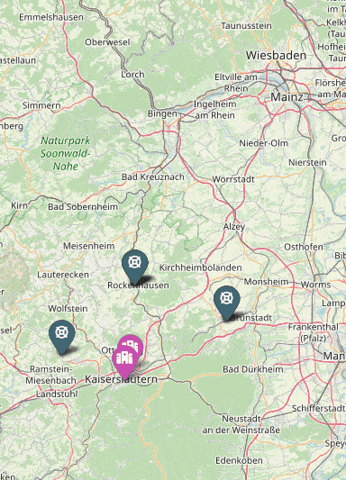

# Emergency Medical Services Strategy Simulator


[](https://github.com/LougineShalaby234/EMS-Strategy-Simulator/actions/workflows/python-tests.yml) 

[](https://codecov.io/gh/LougineShalaby234/EMS-Strategy-Simulator)

[](LICENSE)


This document explains how to set up and run the **EMS Strategy Simulator**, a single-player simulation where a Python-based agent is responsible for dispatching ambulances in response to emergency calls. The simulator is designed to evaluate and compare different dispatch strategies in realistic, map-based scenarios. It includes ready-to-use maps for Montgomery County in Pennsylvania, Rheinland-Pfalz in Germany, and the city of Kaiserslautern. The simulation supports customizable agent logic, integration with real-world routing APIs, and produces detailed logs and visualizations to analyze system performance. This tool is intended for **research and development** in emergency medical services (EMS), offering a flexible and practical environment for testing intelligent dispatch and resource allocation strategies.

---

## Run in Google Colab

This notebook installs all required dependencies, clones the GitHub repository, and runs the EMS Strategy Simulator.Everything runs directly in Google Colab, with no local installation needed.

[](https://colab.research.google.com/github/LougineShalaby234/EMS-Strategy-Simulator/blob/main/Getting_Started_with_EMS_Simulator.ipynb)

---

## ⚙️ Installation

Make sure you have either [Miniconda](https://docs.conda.io/en/latest/miniconda.html) or [Anaconda](https://www.anaconda.com/products/distribution) installed.


**Clone or download the repository**, then navigate to the project folder and
**Create and activate the conda environment** by running:

```bash
git clone github.com/LougineShalaby234/EMS-Strategy-Simulator && cd EMS-Strategy-Simulator
conda env create -f environment.yml
conda activate AmbulanceGameEnv
```

Deactivate the environment with `conda deactivate` and see the available environments with `conda env list` to check if the installation was successful.

For **testing**, run `python -m pytest` in the root folder

---

## 🧭 Running the Simulator

After activating your environment, you can run the full simulation and visualization pipeline using:

```bash
python simulator.py                # Runs a single simulation
python translate_log_to_visual.py  # Converts the log file to JSON format
python render.py               # Renders all JSON files in the output directory as HTML maps
python final_visualization.py      # Generates a grouped bar chart from final_results.csv
```
Running `simulator.py` executes one or more experiments and generates output files. For each experiment, two log files are created:  
- A **concise event log** like `output/[scenario]__[agent]__runX.txt`, which records all key events.
- A **detailed per-minute state log** `output/[scenario]__[agent]__runX_detailed.txt` that includes full state in a json format.
- A **summary CSV file** `output/final_results.csv`, containing metrics like average response time per run:

Next, `translate_log_to_visual.py` reads each `_detailed.txt` log and converts it to a structured JSON file such as `output/[scenario]__[agent]__runX_visualization.json`. This JSON consists of a list of `frames`, each representing one simulated minute. Each frame contains tags (entities) and lines (routes)
To explore the simulation visually, simply open the `_master.html` file.
Finally, `final_visualization.py` reads the cumulative results in `final_results.csv` and generates a grouped bar chart `final_results.jpg`, visualizing the performance of agents across scenarios

---

**Optional: High-Quality Maps with Google Tiles**

By default, the visualization uses **OpenStreetMap** tiles.

To enable **Google Maps tiles**, set your Google Maps API key at the top of `render.py`:

```python
GOOGLE_MAPS_API_KEY = "your-api-key-here"
```

If a valid key is provided, Google Maps tiles will be used automatically.  
> ⚠️ **Note:** Google Maps usage incurs costs beyond free tier limits.

---
**Custom Arguments**

You can run the simulator with custom arguments:

```bash
python simulator.py \
  --map="input/map_montgomeryPa.json" \
  --scenario="input/calls_montgomeryPa_day1_full.json" \
  --agent="agents/agent_random.py" \
  --outfolder="mylogs" \
  --num-exp=3
```

Omitted arguments will use default values and `--scenario` is inferred from the `--map` filename if not provided.

---
## 📊 Results

Emergency response strategies were evaluated using the **average time from emergency call to hospital arrival**.
The figure below compares different dispatcher policies (scripts in the `agents/` folder) across multiple scenarios on the *Montgomery* map.  


---
## 🖼️ Animated View 



---

## 🤖 Building Your Own Agent


The **Simulator** takes in map and call data, and interacts with external **Routing APIs** to calculate routes and travel times. It continuously exchanges information with the **Agent**, sending the current state and receiving decisions in return. The agent can optionally use **Prediction Models** to support its choices. As the simulation runs, the simulator creates **log files**, which are later processed into **HTML visualizations** for easy review and analysis.

The available decisions are:

### 1. `SendAmbulanceToEmergency`
Assigns an ambulance to an emergency.
- **Format:** `("SendAmbulanceToEmergency", ambulance_id, emergency_id)`
- **Example:** `("SendAmbulanceToEmergency", 3, 17)`
- **Conditions:**
  - The emergency must have status `waiting_for_assignment`.
  - The ambulance must not be broken and must be idle or relocating.
- **Effect:**
  - The ambulance is marked as en route to the emergency.
  - The emergency status changes to `waiting_for_ambulance`.
  - The estimated arrival time is computed.

### 2. `SendAmbulanceToHospital`
Directs an ambulance to transport a patient to a hospital.
- **Format:** `("SendAmbulanceToHospital", ambulance_id, hospital_id)`
- **Example:** `("SendAmbulanceToHospital", 5, 2)`
- **Conditions:**
  - The ambulance must contain a patient.
  - The ambulance must not be broken or en route to an emergency.
- **Effect:**
  - The ambulance is assigned to the hospital and marked as `on the way to hospital`.
  - The estimated arrival time is computed.

### 3. `RelocateAmbulance`
Moves an idle ambulance to a new location.
- **Format:** `("RelocateAmbulance", ambulance_id, destination_lat, destination_lng)`
- **Example:** `("RelocateAmbulance", 7, 52.5200, 13.4050)`
- **Conditions:**
  - The ambulance must be idle or already relocating.
  - The ambulance must not be broken or en route to an emergency.
- **Effect:**
  - The ambulance is marked as relocating.
  - The estimated arrival time is computed.

### 4. `ChangeTargetHospital`
Redirects an ambulance to a new hospital if the current one is full.
- **Format:** `("ChangeTargetHospital", ambulance_id, new_hospital_id)`
- **Example:** `("ChangeTargetHospital", 8, 4)`
- **Conditions:**
  - The ambulance must be `on the way to hospital` or `at emergency`.
  - The new hospital must have available beds.
- **Effect:**
  - The ambulance is reassigned to the new hospital.
  - The estimated arrival time is recomputed.


The agent can issue any combination of the above decisions at each step, but the simulator enforces constraints to ensure logical consistency. Invalid decisions are ignored. The environment then progresses by one minute before calling the agent again.


---

### Ambulance Dispatch Agents  

#### 1. **Random Agent** *(Baseline)*  
- **Strategy**: Picks ambulances/hospitals randomly. 
- **Best for**: Testing simulator functionality.  
- **Modify**: Edit the `0.1` in `random.random() <= 0.1` to size relocations (e.g., `0.05` = 5% chance).  

#### 2. **Greedy (Nearest) Agent** *(Fast Response)*  
- **Strategy**: Always dispatches the closest idle ambulance and nearest hospital (with free beds).  
- **Best for**: Scenarios where speed matters most.  
- **Modify**:  
  - `random.random()` <  0.01 → Controls how often idle ambulances randomly relocate (1% default).  
  - Replace `travel_time()` with custom distance calculations.  

#### 3. **Zone Balancer** *(Coverage-Focused)*  
- **Strategy**: Ensures ambulances cover predefined "key zones" within 10 minutes. Relocates only to fill gaps.  
- **Best for**: Systems with known high-risk areas (e.g., dense urban centers).  
- **Modify**:  
  - `coverage_threshold_minutes` → Adjust response time goals (e.g., 15 for rural areas).  
  - Add/remove zones in `state.key_zones`.  

#### 4. **Spatiotemporal Optimizer** *(AI-Powered)*  
- **Strategy**: Uses machine learning to predict emergencies every 3 hours, then rebalances ambulances across 20km grid cells.  
- **Best for**: Large-scale systems with historical emergency data.  
- **Modify**:  
  - `_GRID_KM = 20.0` → Smaller values (e.g., `10.0`) for tighter clusters.  
  - `_RELOCATION_PERIOD_S = 10800` → Change `10800` (3 hours) to `7200` (2 hours) for faster updates.  

---


## 🚑 Routing Options

By default, the simulator uses **linear interpolation** to estimate ambulance travel times. It requires **no internet connection or API** and is ideal for lightweight, offline simulations.

However, for more **realistic and road-aware routing**, you can enable one of the supported APIs:


We support the routing backends: 

- **[Google Maps API](https://developers.google.com/maps/documentation/routes)**: High-accuracy, real-time traffic routing; free usage cap, then **[\$5–\$15/1,000 requests](https://developers.google.com/maps/billing-and-pricing/pricing)**
- **[HERE Maps API](https://www.here.com/platform/routing)**: Robust routing with turn restrictions, traffic, and vehicle profiles; free tier **[30,000 transactions/month](https://www.here.com/get-started/pricing)**
- **[Valhalla (Mapbox)](https://github.com/valhalla/valhalla)**: **Open-source**. You can easily run Valhalla locally; no additional Python packages are required. Instead, the setup relies purely on Docker. Simply install Docker, and then launch a Valhalla server locally using the following command:  
`docker run -d -p 8002:8002 ghcr.io/valhalla/valhalla:latest`.  
This will start the Valhalla routing engine listening on `http://localhost:8002`. Once the server runs, set the `VALHALLA_API_URL` variable inside .env to `"http://localhost:8002/route"`. Advanced configuration options are available in the [official Valhalla documentation](https://valhalla.github.io/valhalla/)

- **[OpenRouteService (ORS)](https://openrouteservice.org/dev/#/api-docs)**: Free and open, **[2,000 requests/day](https://openrouteservice.org/plans/)**, hosted by Heidelberg University

Create .env file
   ```bash
HERE_MAPS_API_KEY=XXX
GOOGLE_MAPS_API_KEY=XXX
OPENROUTESERVICE_API_KEY=XXX
VALHALLA_API_URL=http://your-valhalla-instance/route
 ```
and set the `ROUTING_METHOD` parameter in the simulator.

---

## 🔧 Hyperparameters

Below are the main parameters you can customize in `simulator.py`:

1. **`RoutingMethod`**  
   - **Options**: `"Google"`, `"Here"`, `"Openrouteservice"`, `"LinearInterpolation"`, or `"Valhalla"`.  
   - **Default**: `"LinearInterpolation"` (straight-line distance + average speed).  
   - **Note**: Switch to a real API (Google, HERE, etc.) if you have keys in `.env`.

2. **`ProbNoTransport`** (`0.3` by default)  
   - Probability that an emergency **doesn’t** need hospital transport (patient treated on-scene).

3. **`ProbDelay`** (`0.01` by default)  
   - Chance each minute that an ambulance is delayed for 1 minute while en route (traffic, minor breakdown).

4. **`OnsiteTimeMax`** (`10` minutes by default)  
   - How long, at most, an ambulance stays on-scene before it can move on.

5. **`CleaningTimeMax`** (`5` minutes by default)  
   - Maximum cleaning time after delivering a patient to the hospital.

6. **`AvgSpeedKph`** (`40` by default)  
   - Average speed (km/h) used for travel time if using `"LinearInterpolation"`.

---

## 📁 Project Structure  


```
EMS-Strategy-Simulator/
├── .github/                          # GitHub-specific configuration
│   └── workflows/                    # CI/CD automation (GitHub Actions)
│       └── python-tests.yml         # Runs test suite on pushes and PRs
├── agents/                          # All dispatching agent strategies
│   ├── agent_GreedyDispatch.py           # Always picks the closest ambulance and hospital
│   ├── agent_PeriodicZoneBalancer.py     # Periodically redistributes idle ambulances to balance zones
│   ├── agent_Stochastic.py               # Randomly assigns ambulances and hospitals
│   ├── agent_SpatiotemporalOptimizer.py  # Spatiotemporal strategy for smart dispatching
│   └── base_class.py                     # Abstract base class defining the agent interface
├── assets/                          # Contains project figures (e.g., diagrams, plots, or GIFs)
├── emergency_calls_data/   # Emergency call datasets for different geographic regions
│   ├── MontgomeryPennsylvania_calls.csv      # Emergency call data for Montgomery County, PA
│   └── ReinlandPfalz_calls.csv               # Emergency call data for Rheinland-Pfalz, Germany
├── example_output/                  # Contains an example of the output of running the full simulation and visualization pipeline
├── input/                           # Input data: maps, emergency call scenarios, etc.
│   ├── map_ReinlandPfalz.json     # Map with ambulances, hospitals, stations
│   ├── calls_kaiserslautern_Sunday.json     # A specific scenario with time-stamped emergencies
│   └── ...                              # Other map/call scenario files
├── prediction_model/                         # ML models and predictors for emergency call volume forecasting
│   ├── MontgomeryPennsylvania_calls_predictor.pkl     # Trained LightGBM model for Montgomery, PA emergency call volume prediction
│   ├── ReinlandPfalz_calls_predictor.pkl              # Trained LightGBM model for Rheinland-Pfalz, Germany emergency demand forecasting
│   ├── demand_prediction.py                          # Inference-only class for predicting emergency call volumes using pre-trained models
│   └── emergency_call_predictor.py                   # Full training & prediction pipeline for spatiotemporal emergency call modeling with LightGBM
├── tests/                           # Unit tests for validating system components
│   ├── test_agent_greedy_dispatch.py     # Tests for GreedyDispatch agent behavior
│   ├── test_agent_stochastic.py          # Tests for Stochastic agent behavior
│   ├── test_translate_log_to_visual.py   # Tests the conversion of logs to structured JSON
│   └── test_simulator.py                 # Tests the core simulation loop logic
├── .gitignore                       # Excludes generated/output files from Git tracking
├── environment.yml                  # Conda environment specification (Python + packages)
├── final_visualization.py          # Generates performance bar charts from final_results.csv
├── README.md                       # Project documentation and usage instructions
├── render.py                       # Renders a single or batch of simulations into interactive HTML frames
├── simulator.py                    # Main simulation engine (event loop, agents, routing)
└── translate_log_to_visual.py      # Converts simulation logs into structured JSON for rendering
```

---

## Train Your Own Calls Predictor

This model predicts emergency call volumes based on location and time using LightGBM. It processes raw emergency call data, performs spatiotemporal aggregation, and trains a machine learning model to forecast call counts in specific geographic grids.

### Key Features
- Processes raw emergency call data with timestamps and coordinates
- Creates temporal (hourly, daily, seasonal) and spatial (20km grid) features
- Uses LightGBM with Tweedie loss for count prediction
- Provides model evaluation metrics and visualizations
- Supports both training and inference modes

## Usage

### Training a New Model

```bash
python emergency_call_predictor.py train \
    --data path/to/your_data.csv \
    [--model_name custom_model_name] \
    [--output_dir models] \
    [--time_block 3h] \
    [--test_size 0.2]
```

**Options:**
- `--data`: Path to CSV file containing emergency call data (required)
- `--model_name`: Base name for saved model files (default: inferred from input filename)
- `--output_dir`: Directory to save model artifacts (default: 'models')
- `--time_block`: Time aggregation window (default: '3h', options: '1h', '6h', 'D' etc.)
- `--test_size`: Proportion of data for testing (default: 0.2)

**Example:**
```bash
python emergency_call_predictor.py train --data emergency_calls.csv --model_name my_city_predictor
```

### Making Predictions

#### Single Prediction:
```bash
python emergency_call_predictor.py predict \
    --coords "49.45,7.75,2023-06-15 14:00" \
    [--model_path models/custom_model.pkl] \
    [--output simple|json|csv]
```

#### Batch Predictions:
```bash
python emergency_call_predictor.py predict \
    --input path/to/input_data.csv \
    [--model_path models/custom_model.pkl] \
    [--output simple|json|csv]
```

**Options:**
- `--coords`: "latitude,longitude,datetime" for single prediction
- `--input`: CSV file for batch predictions
- `--model_path`: Path to trained model (default: looks in 'models' folder)
- `--output`: Output format (default: 'simple')

**Output Formats:**
- `simple`: Human-readable output
- `json`: Structured JSON output
- `csv`: Comma-separated values

**Examples:**
```bash
# Single prediction with simple output
python emergency_call_predictor.py predict --coords "49.45,7.75,2023-06-15 14:00"

# Batch predictions with JSON output
python emergency_call_predictor.py predict --input test_locations.csv --output json
```

## Input Data Requirements

The model requires timestamp and location data in CSV format **for training**, automatically detecting common column names like "timestamp", "latitude", and "longitude". **For predictions**, you can either provide a single location as "lat,lon,datetime" string or a CSV file matching the training data structure. The system handles all necessary feature engineering internally, including temporal patterns and spatial grid mapping.
## Output Artifacts

When training, the model saves:
- `.pkl` file: Trained model
- `.json` file: Feature metadata and metrics
- `.png` files: Feature importance and evaluation plots

---

## 🔬 Research Questions
- How accurately do different dispatch strategies perform in realistic EMS simulation environments , and what metrics best capture their comparative performance?
- Which modeling choices and hyperparameter settings are most critical for building valid, high-fidelity EMS simulations?
- How does incorporating contextual data (e.g., weather, traffic, demographics) affect emergency demand forecasting accuracy?
- What role does demand forecasting and ambulance availability prediction play in improving dispatch efficiency and response times?

---

